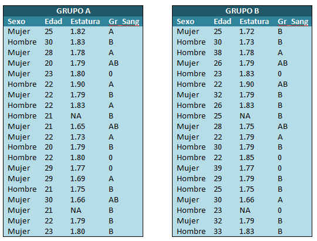

Realización ejercicio 2 (http : //wpd.ugr.es/~bioestad/guia-r-studio/practica-2/#14)


```{r}

```

a) Crear dos conjuntos de datos, de nombre GrA y GrB que contengan la información recogida en las tablas anteriores.

```{r}
Sexo_A <- factor(c('Mujer', 'Hombre', 'Mujer', 'Mujer',' Mujer', 'Hombre', 'Mujer', 'Hombre', 'Hombre', 'Mujer', 'Mujer' ,'Hombre', 'Hombre', 'Mujer', 'Mujer', 'Hombre', 'Mujer', 'Mujer', 'Mujer', 'Mujer'), levels = c('Mujer', 'Hombre'))

Edad_A <- c(25, 30, 28, 20, 23, 22, 22, 22, 21, 21, 22, 20, 22, 29, 29, 21, 30, 21, 22, 23)

Estatura_A <- c(1.82, 1.83, 1.78, 1.79, 1.80, 1.90, 1.79, 1.83, NA, 1.65, 1.73, 1.79, 1.80, 1.77, 1.69, 1.75, 1.66, NA, 1.79, 1.80)

Gr_Sang_A <- c('A', 'B', 'A', 'AB', '0', 'A', 'B', 'A', 'B', 'AB', 'A', 'B', '0', '0', 'A', 'B', 'AB', 'B', 'B', 'B')

GrA <- data.frame (Sexo_A,Edad_A, Estatura_A, Gr_Sang_A)
GrA

```

b) Representar la variable Gr_Sang mediante un diagrama de sectores en cada uno de los grupos. Incluir un título descriptivo en cada gráfico y colorear los sectores de azul, amarillo, rosa y verde.

c) Representar la variable Estatura mediante un histograma en cada uno de los grupos.

d) ¿Existe algún dato atípico en la variable Edad en el grupo A? ¿Y en el grupo B?

e) ¿Cuál es el valor máximo del 40% de las estaturas más pequeñas de los individuos en el grupo A? ¿Y el valor mínimo del 30% de las estaturas mayores de los individuos en el grupo B?

f) ¿Dónde son las variables edad y estatura más homogénea: en el grupo A o en el B?

g) ¿En qué grupo presentan los individuos una altura media mayor? ¿En qué grupo presentan los individuos una altura mediana menor?

h) Estudia la asimetría y la curtosis de la variable Estatura en en el grupo A.

```{r}
plot(cars)
```
